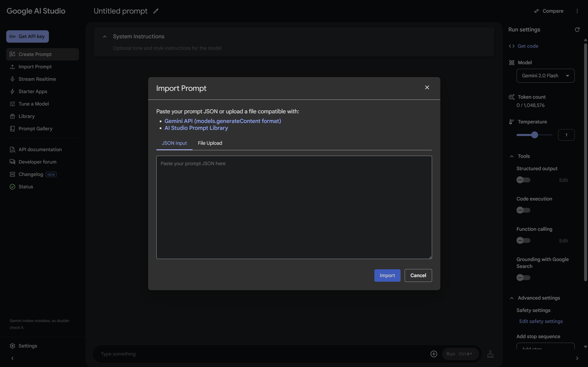
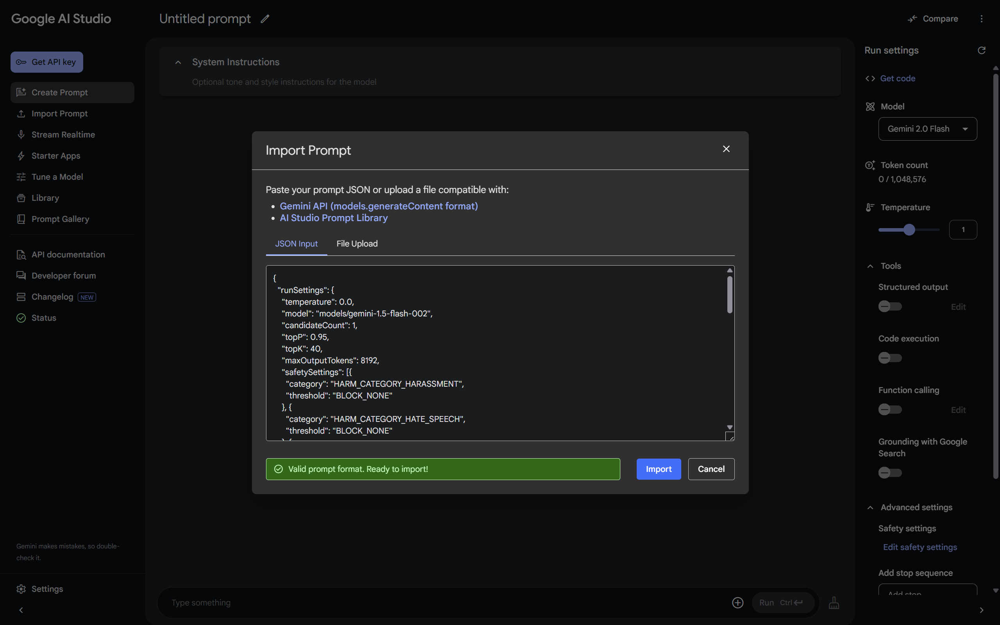

# AI Studio Extended

A Chrome extension that enhances Google's AI Studio with additional functionality, making your AI development workflow more efficient.

## What It Does

This extension adds useful features to Google's AI Studio, including:

-   **Import Prompt Button**: Adds a convenient "Import Prompt" button right below the "Create Prompt" button in the navigation menu
-   Works exclusively on [Google AI Studio](https://aistudio.google.com/)
-   Seamlessly integrates with the existing AI Studio interface

## Screenshots

Here's how the extension looks in action:

### Import Prompt Dialog

### File Selection

### File Opened

### Validation Success

### Error Handling

## Installation

### From Chrome Web Store (Coming Soon)

1. Visit the Chrome Web Store page for AI Studio Extended (link will be provided once published)
2. Click "Add to Chrome"
3. Confirm the installation when prompted

### Manual Installation (For Developers or Advanced Users)

1. Download the latest release from the [Releases page](https://github.com/Dillonu/ai-studio-extended/releases)
2. Unzip the downloaded file
3. Open Chrome and navigate to `chrome://extensions/`
4. Enable "Developer mode" in the top-right corner
5. Click "Load unpacked" and select the unzipped directory
6. The extension should now be installed and active when you visit [AI Studio](https://aistudio.google.com/)

## Usage

1. Visit [Google AI Studio](https://aistudio.google.com/)
2. Look for the new "Import Prompt" button in the navigation menu (just below "Create Prompt")
3. Use this button to import prompts from external sources

## Privacy & Security

-   This extension only runs on the AI Studio website (https://aistudio.google.com/)
-   No data is collected or transmitted to external servers
-   The extension requires minimal permissions to function

## For Developers

If you're interested in contributing to this project, please see the [CONTRIBUTING.md](CONTRIBUTING.md) file for development setup instructions and guidelines.

## Support

If you encounter any issues or have suggestions for improvements:

1. Check the [Issues](https://github.com/Dillonu/ai-studio-extended/issues) page to see if your issue has already been reported
2. If not, create a new issue with a clear description and steps to reproduce

## License

This project is licensed under the [Apache 2.0 License](LICENSE).

---

_Note: This extension is not affiliated with, endorsed by, or sponsored by Google or AI Studio. It is an independent project created to enhance the AI Studio experience._
